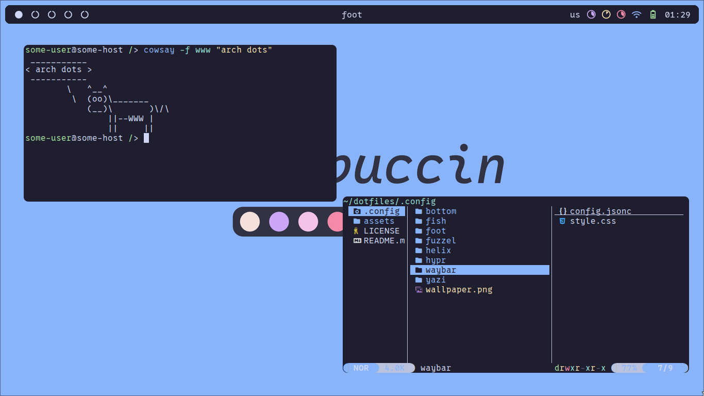
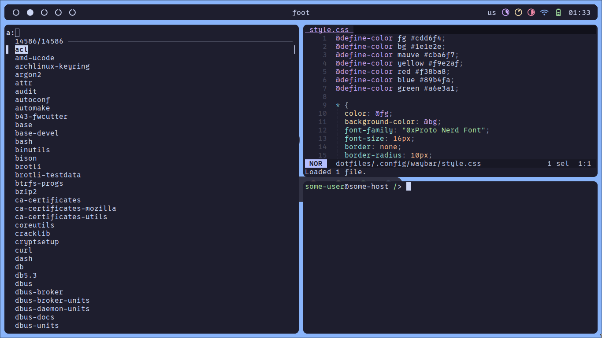

<h1 align="center">catppuccin hyprland dotfiles</h1>

<p align="middle">
  
  
</p>

<h4 align="center">
  hyprland % waybar % fuzzel % foot % fish
</h4>

<h2 align="center"><b>Installation</b></h2>

```sh
sudo pacman -Sy --needed hyprland waybar fuzzel swww cliphist grim slurp ly \
foot fish yazi helix bottom impala less eza fzf ttf-0xproto-nerd vimix-cursors
sudo yay -Sy --needed catppuccin-gtk-theme-mocha

git clone https://github.com/floaaat/dotfiles.git ~/floaaat-dotfiles/
mkdir -p ~/.config/
cp -r ~/floaaat-dotfiles/.config/* ~/.config/

sudo chsh -s /usr/bin/fish

sudo systemctl enable ly.service
```
